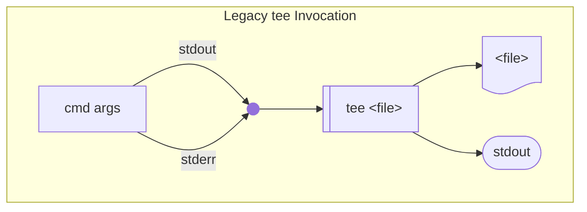
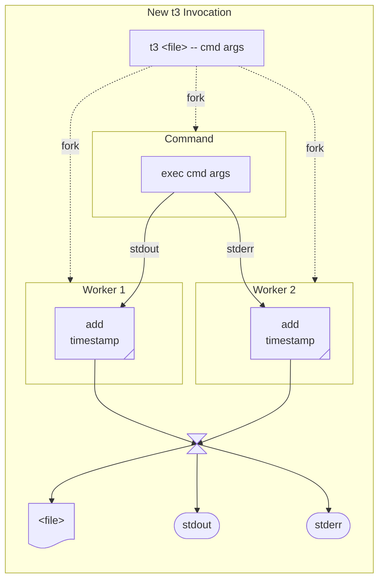

# t3
Next generation `tee` with colorized output streams and precise time stamping.

## Overview

The `t3` command parses the stdout and stderr streams of a command,
writing colorized precisely time-stamped versions of both streams
to the calling process's own stdout and stderr streams,
as well as to the provided filename.
In that respect `tee` is to `t3` what
Perl's `IPC::Open2()` function is to `IPC::Open3()`,
preserving distinct handles for each of the stdout and stderr streams.

It works by creating pipes for parsing the stdout and stderr streams
before invoking the provided command with output redirected to these pipes.
It then forks independent processes that work in parallel
to timestamp the lines of output coming from both streams
while the parent process reassembles and writes colorized and timestamped renditions
both to the provided filename and to its own stdout and stderr streams.

## Motivation

When parsing the output of a build invocation
it is often extremely useful to be able
to differentiate output written to the `stdout` and `stderr` streams,
and occasionally to be able to view the
precise timings of each of those lines in the logs.

Traditionally, when recording the output of a build to a log
the convention is to first merge the `stdout` and `stderr` streams,
and then use a tool like `tee` to multiplex the resulting stream
to both a file and back to the controlling terminal.
This presents a few problems, but most importantly
destroys the ability to identify lines sent to `stderr` in the first place.
Build output from the two streams can also be interleaved,
occasionally resulting in garbled output in the logs.

A depiction of the use of legacy `tee` is shown below:



## A better way

A much better result would be
to preserve the original `stdout` and `stderr` streams
being sent to the controlling terminal
while clearly identifying lines sent to `stderr` in the output file.
That is the role of `t3`, and it does this by way of
a pair of worker processes that apply high-precision timestamps
to lines of output from the invoked command
before forwarding those timestamped messages back to the parent process
where it briefly buffers the messages before sorting, formatting, and collating
the lines back to each of the output file and original `stdout`/`stderr` streams.

A diagram depicting the internal operation of `t3` is shown below:



## Usage

```
Usage: t3 [OPTION] FILE -- COMMAND ARGS ...
Invoke provided command and write its colorized, precise time-stamped output both to the provided fileand to stdout/err.

  -l, --light       use color scheme suitable for light backgrounds
  -d, --dark        use color scheme suitable for dark backgrounds
  -b, --bold        highlight stderr in bold text (with no color)
  -p, --plain       disable all timestamps, ANSI color and highlighting
  -o, --outcolor    color
  -e, --errcolor    color
  -t, --ts          enable timestamps in all outputs
  -h, --help        print this help message
  -v, --version     print version string
  --debug           enable debugging
```

## Installing

The easiest way to get `t3` is using Flox:

1. [install Flox](https://flox.dev)
2. invoke `flox install flox/t3`

## Contributing

This project is developed and maintained with Flox.

1. `flox activate`
2. `make`
